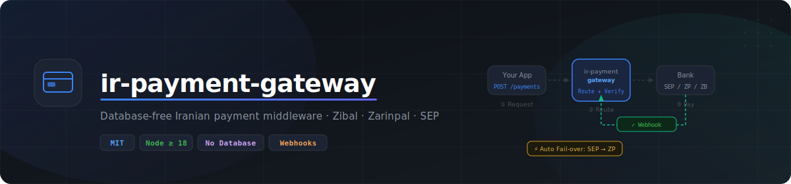

<p align="center">
  
</p>

# ir-payment-gateway

A standalone, database-free Iranian payment gateway service supporting **Zibal**, **Zarinpal**, and **SEP (Saman/Shaparak)**. Instead of writing to a database, it calls configurable webhook URLs when a payment succeeds or fails — your application owns the data layer.

## Features

- **Four gateways**: Zibal, Zarinpal, Zarinpal Sandbox, SEP — switchable per request or forced globally
- **Automatic fail-over**: SEP → Zarinpal on timeout (configurable)
- **Webhook-driven**: on success/failure, POST to your callback URL with a signed payload
- **Retry queue**: failed webhook calls are retried with exponential back-off, persisted to disk
- **SEP refund API**: full SOAP passthrough (Refund_Reg, Refund_Exec, GetDailyRefundList, GetRefundStatus)
- **Optional notifications**: Bale Messenger and Telegram alerts (bring your own bot token)
- **No database required**: only Node.js + the file system
- **Docker-ready**

---

## Quick Start

```bash
git clone https://github.com/azno-space/ir-payment-gateway.git
cd ir-payment-gateway
cp .env.example .env
# Edit .env with your credentials
npm install
npm start
```

---

## Configuration

Copy `.env.example` to `.env` and fill in the values.

### Required

| Variable | Description |
|---|---|
| `CALLBACK_BASE_URL` | Public URL of this service, e.g. `https://pay.example.com` |
| `PAYMENT_SUCCESS_WEBHOOK_URL` | Your app's endpoint — called on verified payment |
| `PAYMENT_FAILURE_WEBHOOK_URL` | Your app's endpoint — called on failed/cancelled payment |

### Gateway Credentials

| Variable | Description |
|---|---|
| `ZIBAL_MERCHANT` | Zibal merchant ID |
| `ZARINPAL_MERCHANT` | Zarinpal 36-char merchant ID (also used for `zarinpal_sandbox`) |
| `ZARINPAL_SANDBOX` | Set to `true` to use sandbox URLs for the `zarinpal` gateway globally |
| `SEP_TERMINAL_ID` | SEP terminal ID |
| `SEP_USERNAME` | SEP refund username |
| `SEP_PASSWORD` | SEP refund password |

### Routing

| Variable | Default | Description |
|---|---|---|
| `FORCED_PAYMENT_GATEWAY` | _(none)_ | Force all payments through one gateway (`zibal`, `zarinpal`, `zarinpal_sandbox`, `sep`) |
| `PAYMENT_FAILOVER_ENABLED` | `true` | Enable automatic fail-over chains |
| `GATEWAY_REQUEST_TIMEOUT_MS` | `8000` | Per-gateway request timeout (ms) |
| `GATEWAY_REQUEST_RETRIES` | `1` | Retries on network error |
| `GATEWAY_LAST_TIMEOUT_MS` | `15000` | Timeout for the last gateway in a fail-over chain |
| `GATEWAY_LAST_RETRIES` | `2` | Retries for the last gateway in a fail-over chain |

### Webhook Security

| Variable | Description |
|---|---|
| `WEBHOOK_SECRET` | If set, every webhook POST includes `X-Webhook-Secret: <value>` |
| `ADMIN_KEY` | Bearer token for admin endpoints |

### UI / Frontend

| Variable | Description |
|---|---|
| `FRONT_BASE_URL` | Your frontend root URL (used for redirect links in error/pending pages) |
| `FRONT_SUCCESS_URL` | Redirect destination after successful payment |
| `SUPPORT_PHONE` | Phone number shown on error pages |
| `SUPPORT_URL` | Support page URL shown on error pages |

### Notifications (optional)

| Variable | Description |
|---|---|
| `BALE_BOT_TOKEN` | Bale bot token for success notifications |
| `BALE_CHAT_ID` | Bale chat ID for success notifications |
| `BALE_FAILED_BOT_TOKEN` | Bale bot token for failure notifications |
| `BALE_FAILED_CHAT_ID` | Bale chat ID for failure notifications |
| `TELEGRAM_BOT_TOKEN` | Telegram bot token |
| `TELEGRAM_CHAT_ID` | Telegram chat ID |
| `TELEGRAM_BASE_URL` | Telegram API base URL (default: `https://api.telegram.org`) |

### Analytics (optional)

| Variable | Description |
|---|---|
| `EVENT_WEBHOOK_URL` | Webhook URL for payment event logging |
| `ANALAS_API_KEY` | [Analas](https://analas.ir) API key for analytics |

---

## API Reference

### `POST /api/payments`

Initiate a payment.

**Request body:**

```json
{
  "orderId": "order-123",
  "amount": 150000,
  "mobile": "09123456789",
  "gateway": "sep"
}
```

| Field | Type | Required | Description |
|---|---|---|---|
| `orderId` | string | Yes | Your order identifier (passed to gateway as ResNum/orderId) |
| `amount` | number | Yes | Amount in Rials |
| `mobile` | string | No | Customer mobile (some gateways prefill the form) |
| `gateway` | string | No | `zibal`, `zarinpal`, `zarinpal_sandbox`, or `sep`. Falls back to `zarinpal` if omitted |

**Response `200`:**

```json
{
  "targetUrl": "https://sep.shaparak.ir/OnlinePG/SendToken?token=...",
  "gateway": "sep",
  "orderId": "order-123"
}
```

Redirect the user to `targetUrl`.

---

### `GET /api/payments/callback` · `POST /api/payments/callback`

Gateway callback — called by the payment gateway after the user completes (or cancels) the flow. **Not called directly by your application.**

On success, this endpoint verifies the transaction with the gateway and POSTs to `PAYMENT_SUCCESS_WEBHOOK_URL`:

```json
{
  "orderId": "order-123",
  "gateway": "sep",
  "code": "<refNum>",
  "status": "success",
  "verifyDetails": { ... },
  "timestamp": "2024-01-01T00:00:00.000Z"
}
```

On failure, it POSTs to `PAYMENT_FAILURE_WEBHOOK_URL`:

```json
{
  "orderId": "order-123",
  "gateway": "sep",
  "code": "",
  "status": "failed",
  "reason": "توسط کاربر انصراف داده شد",
  "timestamp": "2024-01-01T00:00:00.000Z"
}
```

---

### Admin endpoints

All admin endpoints require `Authorization: Bearer <ADMIN_KEY>` header.

| Method | Path | Description |
|---|---|---|
| `GET` | `/api/payments/admin/verify-only` | Verify a transaction with the gateway without side effects |
| `POST` | `/api/payments/admin/trigger-webhook` | Manually fire the success webhook for an order |
| `POST` | `/api/payments/admin/sep/refund/reg` | SEP Refund_Reg |
| `POST` | `/api/payments/admin/sep/refund/exec` | SEP Refund_Exec |
| `GET` | `/api/payments/admin/sep/refund/list` | SEP GetDailyRefundList |
| `POST` | `/api/payments/admin/sep/refund/status` | SEP GetRefundStatus |

#### `GET /api/payments/admin/verify-only`

Query params: `gateway`, `code` (and optionally `amount` for Zarinpal).

#### `POST /api/payments/admin/trigger-webhook`

```json
{ "orderId": "order-123", "gateway": "sep", "code": "<refNum>" }
```

---

## Zarinpal Sandbox

For testing without real money, use the Zarinpal sandbox environment.

**Option A — per-request (recommended for testing):**

```json
{ "orderId": "test-001", "amount": 10000, "gateway": "zarinpal_sandbox" }
```

Pass `gateway: "zarinpal_sandbox"` in your payment request. The same `ZARINPAL_MERCHANT` is used; no extra credentials needed.

**Option B — global switch:**

```env
ZARINPAL_SANDBOX=true
```

This redirects all `zarinpal` gateway calls to sandbox URLs. The gateway name stays `zarinpal` in requests.

| | Sandbox | Production |
|---|---|---|
| API base | `sandbox.zarinpal.com/pg/v4/payment/` | `payment.zarinpal.com/pg/v4/payment/` |
| Payment page | `sandbox.zarinpal.com/pg/StartPay/` | `payment.zarinpal.com/pg/StartPay/` |
| Merchant ID | Same `ZARINPAL_MERCHANT` | Same `ZARINPAL_MERCHANT` |
| Webhook fired | Yes — identical payload | Yes |

> The sandbox does not charge real money. Use it to verify your webhook handler before going live.

---

## Fail-over Chains

When `PAYMENT_FAILOVER_ENABLED=true` (default), failing gateways fall over automatically:

| Primary | Chain |
|---|---|
| `sep` | SEP → Zarinpal |
| `zarinpal` | Zarinpal only |
| `zarinpal_sandbox` | Zarinpal Sandbox only |
| `zibal` | Zibal only |

The last gateway in the chain gets longer timeouts (`GATEWAY_LAST_TIMEOUT_MS`) and more retries.

---

## Webhook Retry Queue

If `PAYMENT_SUCCESS_WEBHOOK_URL` returns a non-200 response or times out, the payload is saved to `data/payment-queue.json` and retried automatically with exponential back-off. You can inspect the queue at `GET /api/test/queue` (non-production).

---

## Docker

```bash
docker build -t ir-payment-gateway .
docker run -p 3000:3000 --env-file .env ir-payment-gateway
```

---

## Development

```bash
npm run dev   # nodemon hot-reload
npm start     # production
```

Test endpoints are available at `/api/test/*` only when `NODE_ENV !== production`.

---

## License

MIT — see [LICENSE](./LICENSE).
